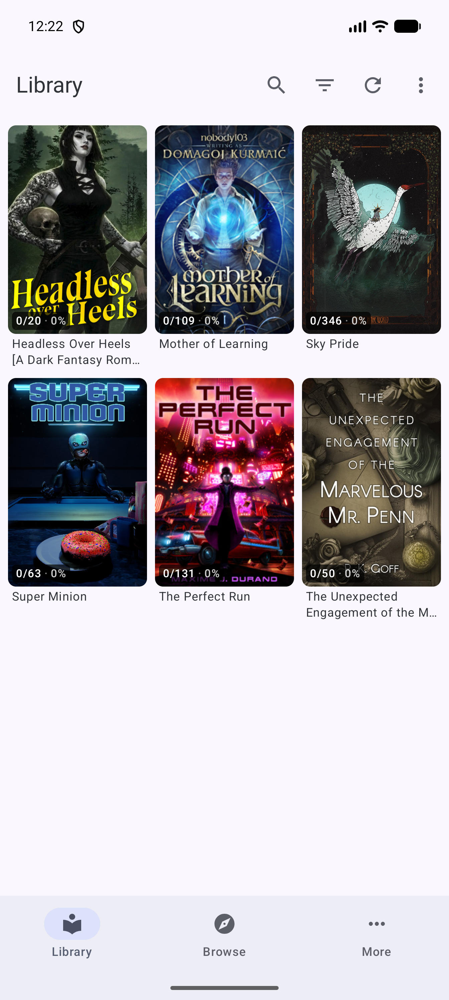
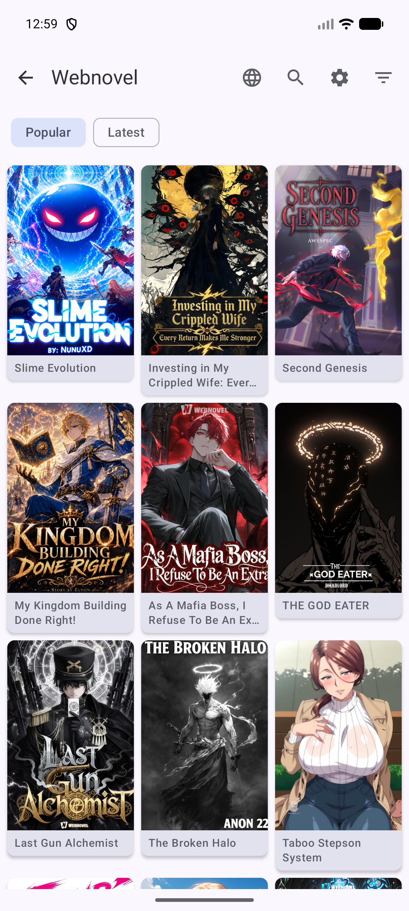
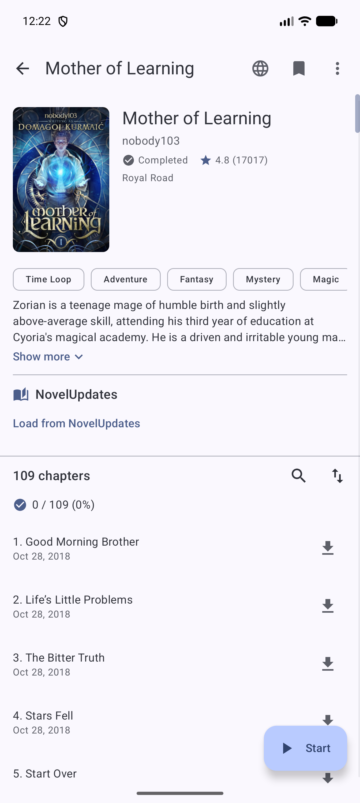
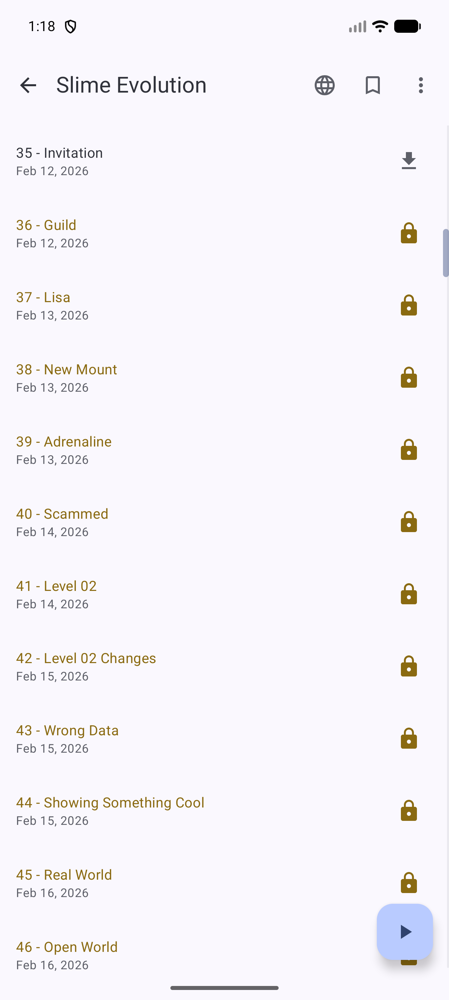

<p align="center">
  
</p>

<h1 align="center">Grimoire</h1>

<p align="center">
  Open-source Android novel reader with an APK-based extension system.<br/>
  Built with Kotlin and Jetpack Compose.
</p>

<p align="center">
  
  
  
  
</p>

## Screenshots

| Library | Browse a source | Novel detail | Locked chapters | Reader |
|:---:|:---:|:---:|:---:|:---:|
|  |  |  |  |  |

## Features

- **Library** — categories (incl. PIN-locked hidden categories), per-category background refresh, custom sort + filter + search, EPUB import, swipeable tabs throughout
- **Reader** — adjustable font, spacing, line height, colour theme and orientation; in-line image privacy mode; optional Text-to-Speech (on-device + ElevenLabs voices)
- **Sources via extensions** — every source is a separate APK the app discovers at runtime via `PackageManager`, so the catalogue grows without re-shipping the app. Ships with the official extension repository enabled out of the box; add your own repos too (including private GitHub repos via OAuth)
- **Downloads** — foreground download service with a per-chapter image store for offline reading
- **NovelUpdates integration** — cross-source metadata, rankings, latest releases, saved series, and "read this with one of your sources" matching
- **Library updates** — background refresh via `WorkManager`, per-novel notification rules, and an update-issues log
- **Source migration** — move a novel from one source to another, keeping its history
- **Backup & restore** — manual and scheduled local backups
- **Statistics & tasks** — reading statistics and a background-task log
- **Self-updating** — in-app updater pulls signed APKs from GitHub releases with changelogs; uncaught crashes are captured on the next launch and pre-fill a GitHub issue

## Architecture overview

```
io.grimoire.app/
├── ui/                  Compose UI (Scaffold, NavHost, screens, ViewModels)
│   ├── AppNavigation.kt   Top-level Scaffold + bottom nav + NavHost
│   ├── AppNavGraphs.kt    Per-feature NavGraphBuilder extensions
│   ├── AppRoutes.kt       Route constants + TopLevelDestination
│   ├── component/         Shared composables (chapter item, fast scroller, …)
│   └── screen/            One package per surface (library, browse, reader, …)
├── data/
│   ├── local/             Room database + DAOs + entities
│   ├── preferences/       DataStore-backed preference classes
│   ├── source/            ChapterListFetcher + paginated-source helpers
│   ├── download/          Foreground download service + chapter image store
│   ├── libraryupdate/     WorkManager scheduler + worker + updater
│   ├── backup/            Backup manager + worker + JSON models
│   ├── tts/               Device + ElevenLabs TTS engines + playback service
│   ├── novelupdates/      NU.com scraper + matcher
│   ├── update/            In-app GitHub release updater
│   ├── epub/              EPUB importer + parser + local source
│   └── cache/             Cover preloader
├── domain/                Auth / migration / NU info repositories
├── extension/             ExtensionLoader + ExtensionManager + repo browsing
├── auth/github/           OAuth device flow for GitHub
├── di/                    Hilt modules (Database, Preferences, GitHubAuth)
└── util/                  Content-language helpers
```

Tech: **Kotlin 2.2**, **Compose BOM 2026.02.01**, **Material 3**, **Hilt 2.59**, **Room 2.7**, **Navigation-Compose 2.8**, **DataStore**, **WorkManager**, **OkHttp 4.12**, **Coil**, **kotlinx-serialization**. minSdk 26, targetSdk 36, Java 11.

## Repositories

Grimoire is split into three repos that ship independently:

| Repo | Purpose |
|------|---------|
| `grimoire` (this) | Main Android app |
| `grimoire-extensions-api` | Shared contract library (Source, Novel, Chapter, Filter…) — consumed via JitPack at `io.grimoire:extensions-api:0.3.0` |
| `grimoire-extensions` | First-party extension APKs (one per source) |

The app does **not** dynamically load extension classes — each extension is a separate APK that the OS installs, discovered via `PackageManager` + a manifest metadata flag. See `app/src/main/java/io/grimoire/app/extension/`.

## Build

Requires Android Studio with the **Android Gradle Plugin 9.2.1** toolchain (Kotlin 2.2.10, KSP 2.2.10-2.0.2). Java 11 source / target.

```bash
# Debug install
./gradlew :app:installDebug

# Run unit tests
./gradlew :app:testDebugUnitTest

# Release APK
APP_VERSION_TAG=v0.1.0 ./gradlew :app:assembleRelease
```

The release `versionCode` is derived from the latest git tag (`vMAJOR.MINOR.PATCH`) plus an optional `APP_BETA_NUMBER` env var. GitHub OAuth client id is read from `gradle.properties` (`GITHUB_OAUTH_CLIENT_ID`) or the same-named env var — forks can drop in their own without patching code.

## Contributing

- Bug reports / feature requests: open an issue
- Extension contributions: see [`grimoire-extensions`](https://github.com/Operation-Grimoire/grimoire-extensions)
- App contributions: see [`CLAUDE.md`](./CLAUDE.md) for an architecture / convention overview before touching the screen / VM layout

## License

To be determined.
